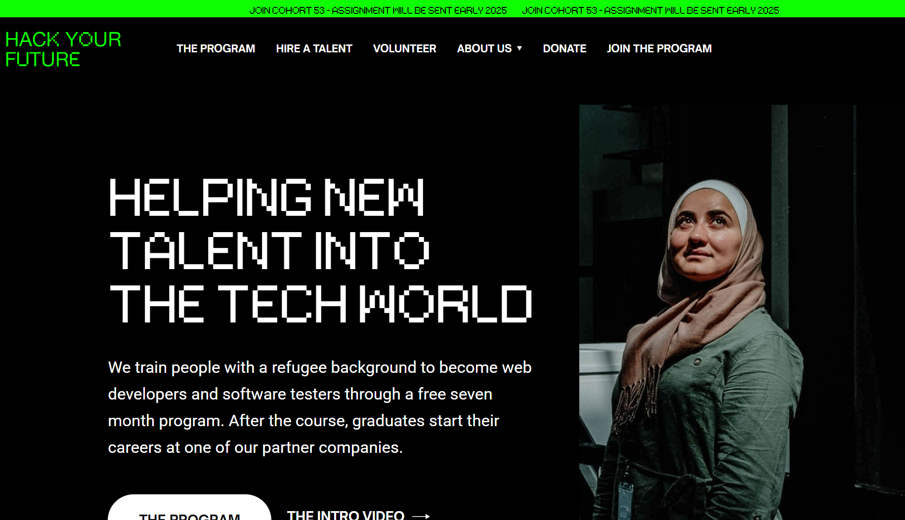
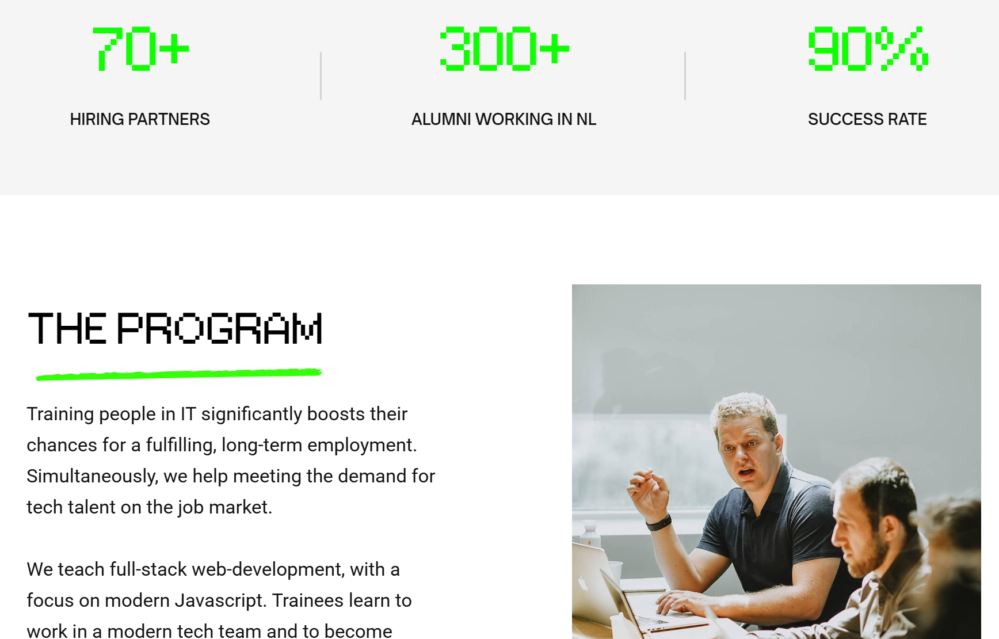
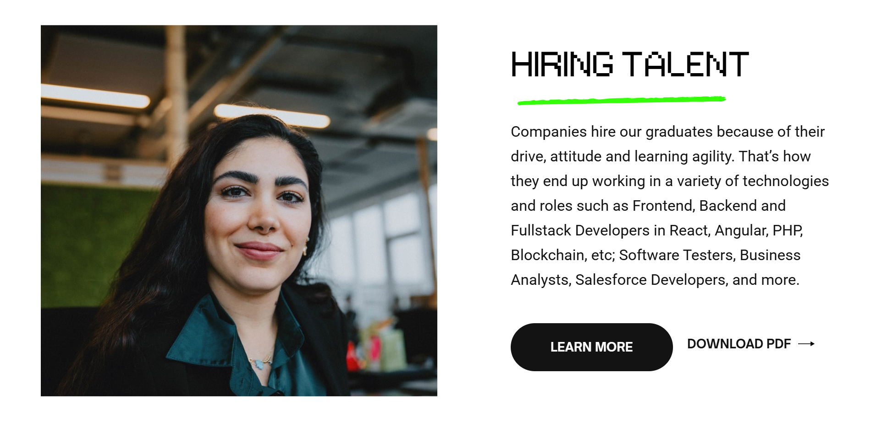

# HYF

> The project is to reverse engineer the
> [Hack Your Future (HYF) website](https://www.hackyourfuture.net/).

## Table of contents

- [HYF](#hyf)
  - [Table of contents](#table-of-contents)
  - [General info](#general-info)
  - [Screenshots](#screenshots)
  - [Technologies](#technologies)
  - [Setup](#setup)
  - [Code Examples](#code-examples)
  - [Features](#features)
  - [Status](#status)
  - [Inspiration](#inspiration)
  - [Contact](#contact)
  - [Instructions for use](#instructions-for-use)
  - [Code Quality Checks](#code-quality-checks)
  - [Continuous Integration (CI)](#continuous-integration-ci)
  - [Repo Setup](#repo-setup)

## General info

> A website for people with limited, for example, refugees, access to education
> and the labor market.

## Screenshots





## Technologies

- Node 14.16.0
- VSC code
- HTML
- CSS

## Setup

- `npm run start`
- `npm install`

## Code Examples

```HTML
  <div style="opacity:0" class="navbar-wrapper">
            <div class="navbar-container bg-dark">
                <div data-collapse="medium" data-animation="default" data-duration="400" data-easing="ease" data-easing2="ease" role="banner" class="navbar w-nav">
                    <div class="navbar-row">
                        <div class="navbar-left-contents">
                            <a href="/" aria-current="page" class="brand w-nav-brand w--current">
                                
                            </a>
                            <nav role="navigation" class="nav-menu left w-nav-menu">
                                <a href="/program" class="nav-link nav-menu-item text-white w-nav-link">THE PROGRAM</a>
                                <a href="/hiring" class="nav-link nav-menu-item text-white w-nav-link">HIRE A TALENT</a>
                                <a href="/volunteer" class="nav-link nav-menu-item text-white w-nav-link">VOLUNTEER</a>
                                <div data-hover="true" data-delay="250" class="dropdown nav-menu-item w-dropdown">
                                    <div class="dropdown-toggle w-dropdown-toggle">
                                        <div class="nav-link text-white">ABOUT US</div>
                                        
                                    </div>
                                    <nav class="dropdown-list w-dropdown-list">
                                        <div>
                                            <a href="/about" class="dropdown-link w-dropdown-link">Organisation</a>
                                            <a href="/team" class="dropdown-link w-dropdown-link">Team</a>
                                            <a href="/values" class="dropdown-link w-dropdown-link">Values</a>
                                            <a href="/impact" class="dropdown-link w-dropdown-link">Impact</a>
                                        </div>
                                    </nav>
                                </div>
                                <a href="/donate" class="nav-link nav-menu-item text-white w-nav-link">DONATE</a>
                                <a href="/apply" class="nav-link nav-menu-item text-white w-nav-link">JOIN THE PROGRAM</a>
                            </nav>
                        </div>
                        <div class="navbar-right-contents">
                            <div class="menu-button w-nav-button">
                                
                            </div>
                        </div>
                    </div>
                </div>
            </div>
        </div>
```

```CSS
body {
    margin: 0
}

article,aside,details,figcaption,figure,footer,header,hgroup,main,menu,nav,section,summary {
    display: block
}

audio,canvas,progress,video {
    vertical-align: baseline;
    display: inline-block
}

audio:not([controls]) {
    height: 0;
    display: none
}

[hidden],template {
    display: none
}

a {
    background-color: #0000
}

a:active,a:hover {
    outline: 0
}

abbr[title] {
    border-bottom: 1px dotted
}

```

## Features

List of features ready and Todos for future development

- [x] announcement bar
- [x] navigation bar
- [x] main content and the animation
- [x] resource links for information
- [x] footer navigation bar and useful links

To-do list:

- [ ] case studies and video links

## Status

Project is: _done_

## Inspiration

Project by HYF 2025 Group 4

## Contact

- [Alamgir](https://github.com/alamgir1973)
- [Artur](https://github.com/gritchin-artur)
- [Roman](https://github.com/kovbinka)
- [Manloi](https://github.com/jimanloi)

## Instructions for use

<!-- a guide to using this repository -->

1. `git clone git@github.com:HackYourFutureBelgium/template-markdown.git`
2. `cd template-markdown`
3. `npm install`

## Code Quality Checks

- `npm run format`: Makes sure all the code in this repository is well-formatted
  (looks good).
- `npm run lint:ls`: Checks to make sure all folder and file names match the
  repository conventions.
- `npm run lint:md`: Will lint all of the Markdown files in this repository.
- `npm run lint:css`: Will lint all of the CSS files in this repository.
- `npm run validate:html`: Validates all HTML files in your project.
- `npm run spell-check`: Goes through all the files in this repository looking
  for words it doesn't recognize. Just because it says something is a mistake
  doesn't mean it is! It doesn't know every word in the world. You can add new
  correct words to the [./.cspell.json](./.cspell.json) file so they won't cause
  an error.
- `npm run accessibility -- ./path/to/file.html`: Runs an accessibility analysis
  on all HTML files in the given path and writes the report to
  `/accessibility_report`

## Continuous Integration (CI)

When you open a PR to `main`/`master` in your repository, GitHub will
automatically do a linting check on the code in this repository, you can see
this in the[./.github/workflows/lint.yml](./.github/workflows/lint.yml) file.

If the linting fails, you will not be able to merge the PR. You can double check
that your code will pass before pushing by running the code quality scripts
locally.

## Repo Setup

- Give each member **_write_** access to the repo (if it's a group project)
- Turn on GitHub Pages and put a link to your website in the repo's description
- Go to _General_ Section > check **Discussions**
- In the _Branches_ section of your repo's settings make sure the
  `master`/`main` branch must:
  - "_Require a pull request before merging_"
  - "_Require approvals_"
  - "_Dismiss stale pull request approvals when new commits are pushed_"
  - "_Require status checks to pass before merging_"
  - "_Require branches to be up to date before merging_"
  - "_Do not allow bypassing the above settings_"

</details>
