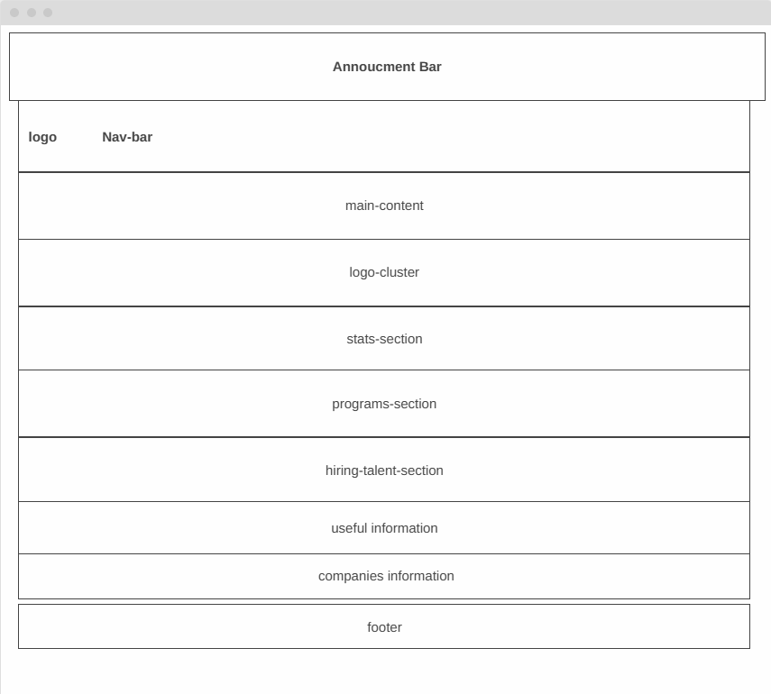

# Design

## Project's design overview

> The HackYourFuture website has a clean, modern, and functional design that
> aligns with its mission of providing accessible coding education

<!-- give an overview of your project's design -->
<!-- describe the reasoning behind your group's design and wireframe -->
<!-- include other centralized decisions like fonts, palates, ... -->

---

## Wireframe(s)

>

<!-- provide a link to your wireframe documenting on Figma, or wherever it is -->
